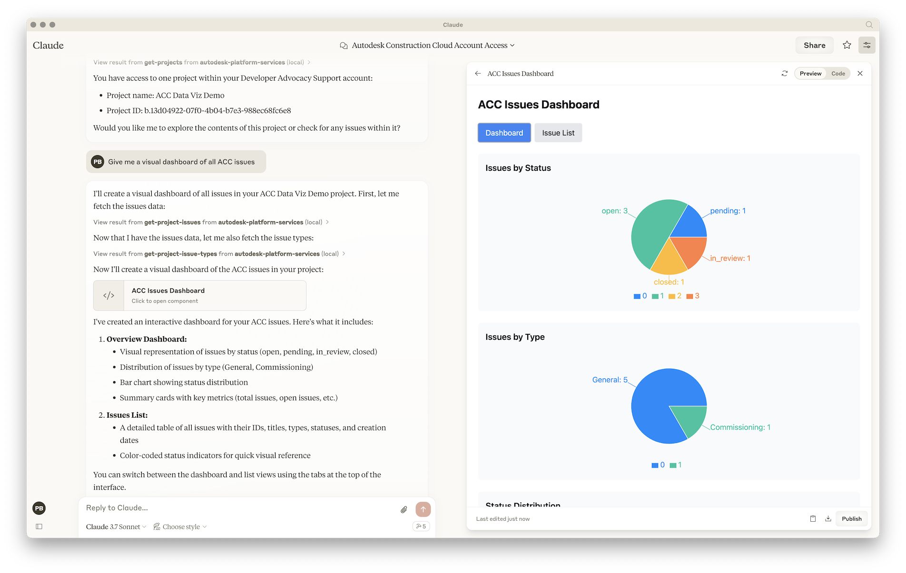

# aps-mcp-server

Experimental [Model Context Protocol](https://modelcontextprotocol.io) server build with Node.js, providing access to [Autodesk Platform Services](https://aps.autodesk.com) API, with fine-grained access control using the new _Secure Service Accounts_ feature.



## Development

### Prerequisites

- [Node.js](https://nodejs.org)
- [APS app credentials](https://aps.autodesk.com/en/docs/oauth/v2/tutorials/create-app) (must be a _Server-to-Server_ application type)
- [Provisioned access to ACC or BIM360](https://get-started.aps.autodesk.com/#provision-access-in-other-products)

### Setup

- Clone this repository
- Install dependencies: `yarn install`
- Build the TypeScript code: `yarn run build`
- Create a _.env_ file in the root folder of this project, and add your APS credentials:
    - `APS_CLIENT_ID` - your APS application client ID
    - `APS_CLIENT_SECRET` - your APS application client secret
- Create a new service account: `npx create-service-account ssa-test-user John Doe`
    - This script will output an email of the newly created service account, and a bunch of environment variables
- Add or overwrite the new environment variables in your _.env_ file
    - `APS_SA_ID` -  your service account ID
    - `APS_SA_EMAIL` - your service account email
    - `APS_SA_KEY_ID` - your service account key ID
    - `APS_SA_PRIVATE_KEY` - your service account private key
- Invite the service account email as a new member to your ACC project(s)

### Use with Inspector

- Run the [Model Context Protocol Inspector](https://modelcontextprotocol.io/docs/tools/inspector): `yarn run inspect`
- Open http://localhost:5173
- Hit `Connect` to start this MCP server and connect to it

### Use with Claude Desktop

- Make sure you have [Claude Desktop](https://claude.ai/download) installed
- Create a Claude Desktop config file if you don't have one yet:
    - On macOS: _~/Library/Application Support/Claude/claude\_desktop\_config.json_
    - On Windows: _%APPDATA%\Claude\claude\_desktop\_config.json_
- Add this MCP server to the config, using the absolute path of the _build/server.js_ file on your system, for example:
```json
{
    "mcpServers": {
        "autodesk-platform-services": {
            "command": "node",
            "args": [
                "/absolute/path/to/aps-mcp-server/build/server.js"
            ]
        }
    }
}
```
- Open Claude Desktop, and try some of the following test prompt:
    - What ACC projects do I have access to?
    - Give me a visual dashboard of all issues in project XYZ

> For more details on how to add MCP servers to Claude Desktop, see the [official documentation](https://modelcontextprotocol.io/quickstart/user).